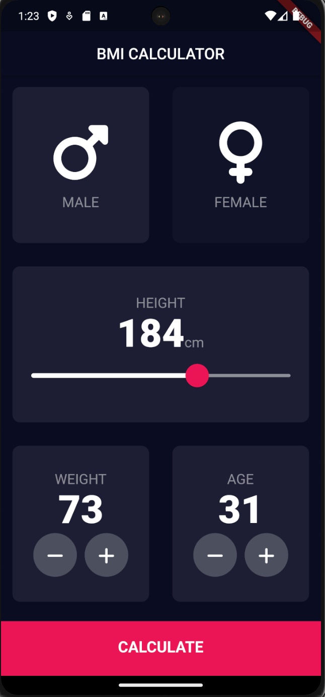
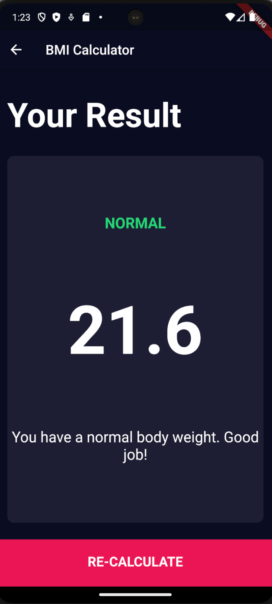
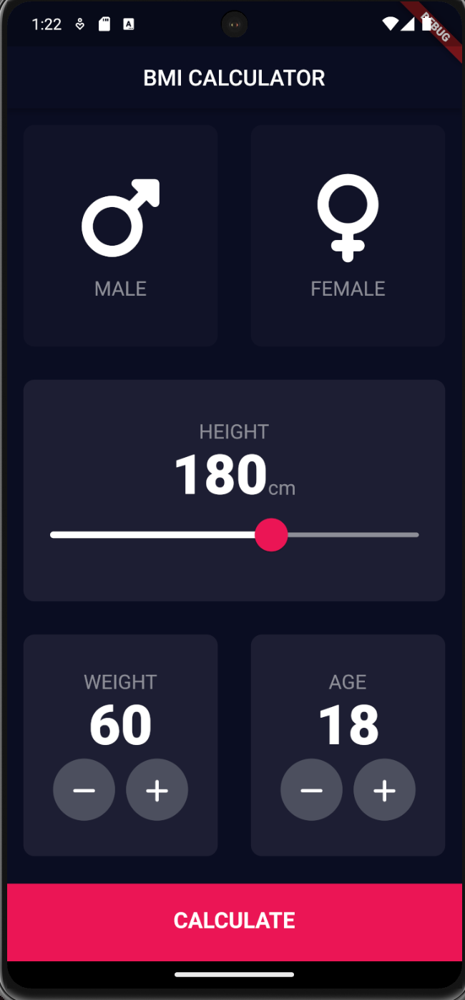

# BMI Calculator App

### [Link to flutter tutorial](https://www.udemy.com/course/flutter-bootcamp-with-dart/?couponCode=OF53124)

## Overview:
- The BMI Calculator focuses on customization of flutter widgets. The application allows a user to calculate their BMI(body mass index) value and corresponding weight status while taking age into consideration.

## What I learn about flutter/dart with project: 
- Final, Const
- Custom Flutter Widgets
- Enums
- Ternary Operator
- Functions
- Maps
- Inheritance

## Screenshots: 

    
    
    

## Installation/Running steps :computer: :

### Running project
- Add [Flutter](https://docs.flutter.dev/get-started/install) to your machine
- Open this project folder with Terminal/CMD and run `flutter packages get`
- Run `flutter run` to build and run the debug app on your emulator/phone
